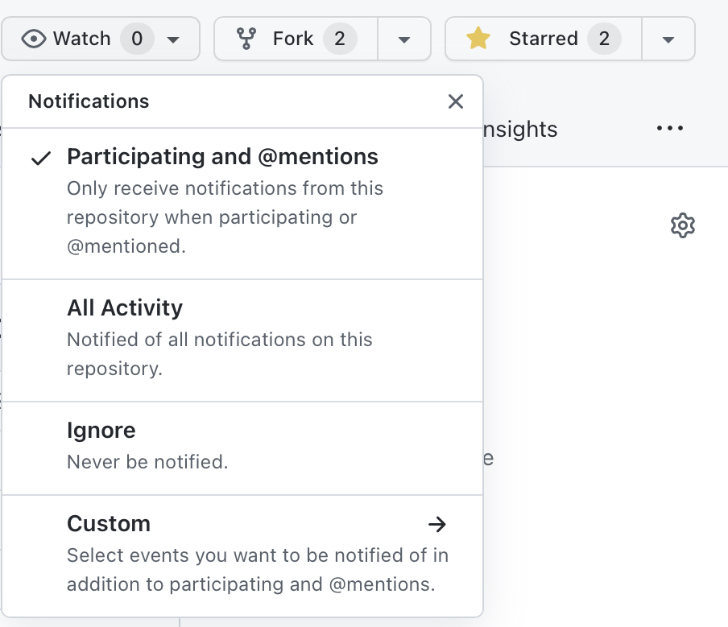
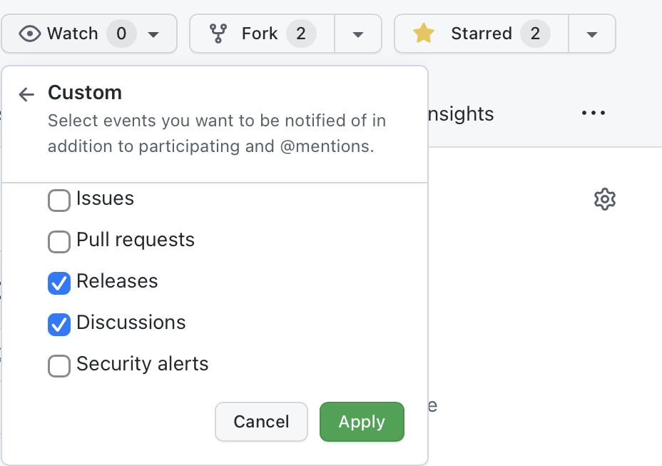

# 使用方法

## 故事 & 公告 🪧

在「故事」栏，我们将所有前辈们的经验故事进行了分类和整理，在这里你可以看到所有投稿。

在「公告」栏，我们将重要信息进行了提取，以便大家获取最新须知和网站进展。

## 在「目录」中找到故事 👀

在桌面端网页左侧⬅️可以看到目录栏，点击不同学院名称可以查看到对应学院的前辈们的上岸经验。

目录按照「学院-去向类别-本科入学年份」进行不同层级的设置，可以根据想要了解的类型进行点击查看。

:::tip

如果你正在使用移动设备（手机，平板等），请点击屏幕左上方的 ☰ 打开目录。

:::

## 根据「关键词」搜索 🔍

在网页的右上角↗️设置有搜索栏，可以根据想要搜索的关键词检索自己希望搜索的故事或公告。

## 根据「标签」找到同类故事 🏷️

在每篇故事下方⬇️，都有设置**标签**栏目，点击对应的标签🏷，将会跳转至归类为该标签下的所有故事。

:::info

PS：标签中的，以及目录和故事标题中出现的「年份」代表入学年份，不要混淆啦。

:::

## 如何投稿 ✍️

具体请参考[投稿指南](./how-to-contribute)并进行相关操作，如有任何问题也欢迎随时在其评论区发表。

---

:::tip

为了使用以下所列举的功能，你需要：

1. 电子邮箱
2. GitHub账号
   - 需要使用电子邮箱注册
   - [点此注册](https://github.com/signup)

:::

## 评论区 💬

在每一篇故事以及公告的下方，我们都设置了评论区。你可以自由发表评论、展开讨论，但请注意言论文明哦。

## 论坛 🥳

https://github.com/ECUST-Leap/ecust-leap.github.io/discussions

有任何想要聊的内容欢迎大家发帖。

## 推送更新

### 电子邮件

:::caution

此功能仍在测试阶段。欢迎试用并告诉我们使用体验！

:::

如果你想要在我们有新投稿/新功能发布后收到一封邮件通知，请：
1. 进入 https://github.com/ECUST-Leap/ecust-leap.github.io
2. 在界面右上角，点击`Watch`

3. 点击`Custom`，并勾选`Releases`以及`Discussions`。

:::tip

如果你想表达对我们的喜爱和支持，请顺手点击一下`Star`！

:::

:::note

如果你不想在论坛有更新时收到邮件通知，请不用勾选`Discussions`。

:::