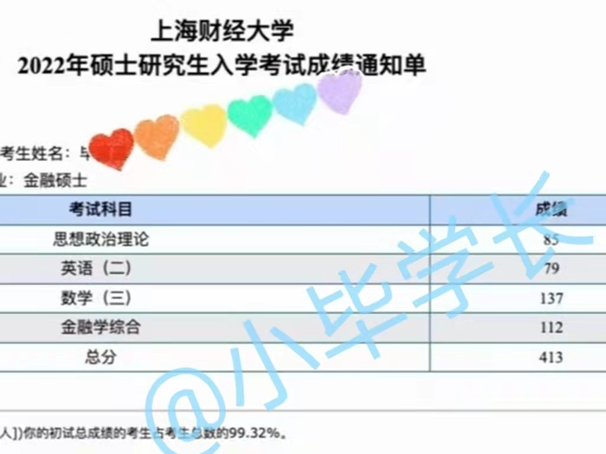
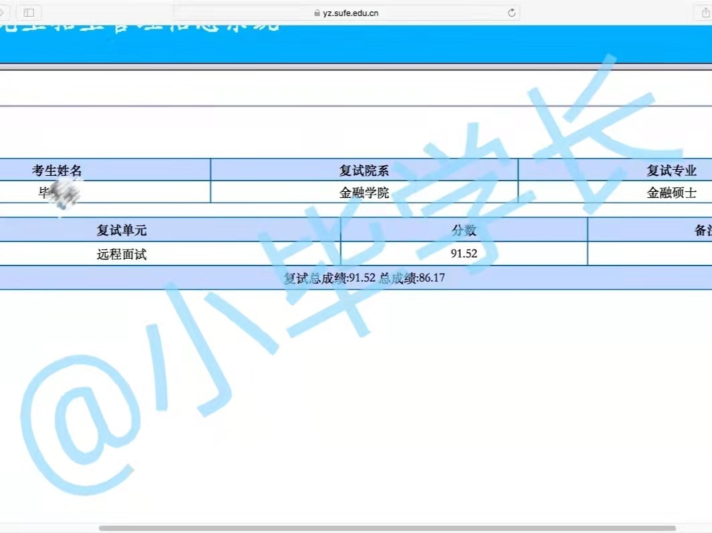
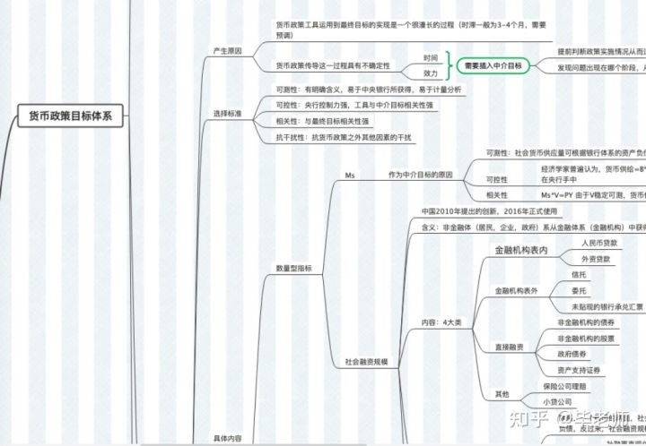
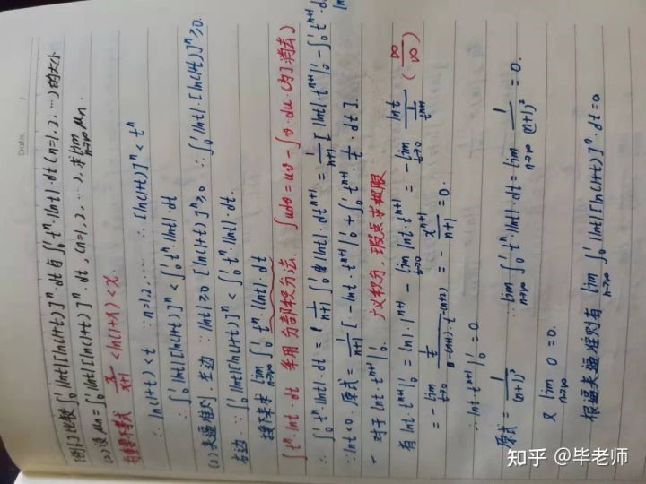
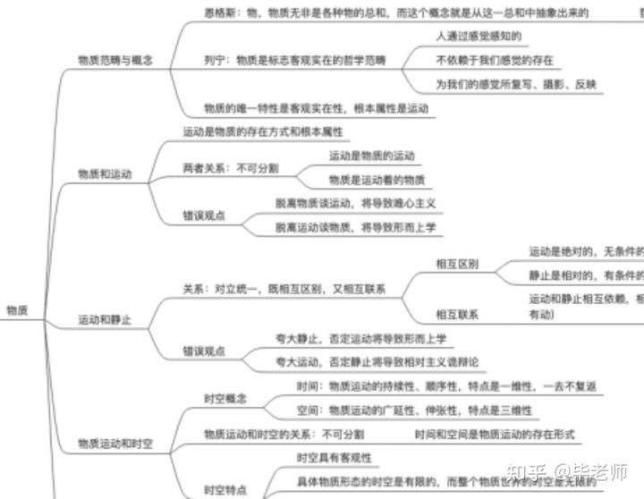
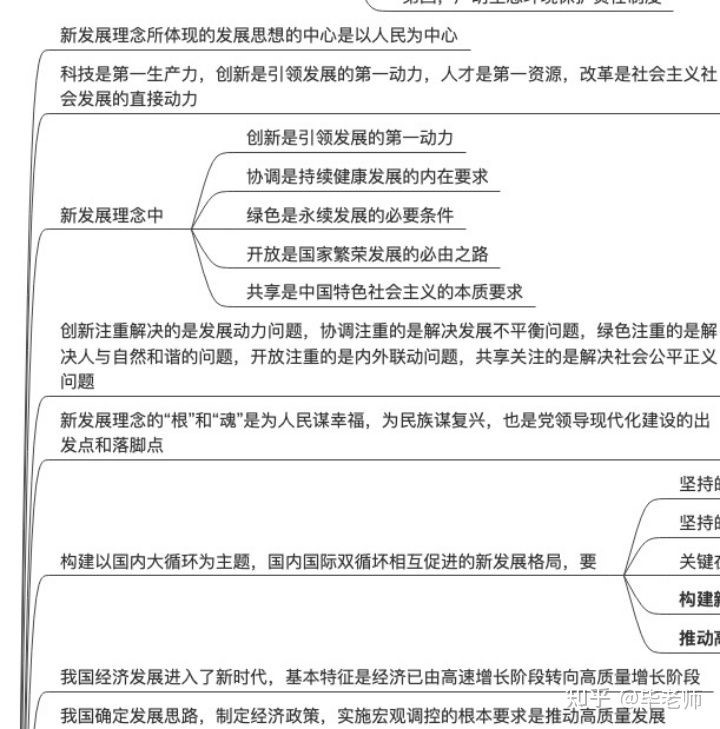

---
tags:
  - 考研
  - 社会与公共管理学院
  - 公共事业管理
  - 2018
  - 上海财经大学
  - 金融
description: 整整一年的埋头苦学让努力有了回报
---

# lulu (2019) : 金融专硕 @ 上财

## 基本背景

- Major：公共事业管理
- Submajor：数学

## 考研心得

初试成绩打地基！

复试成绩盖好楼！

### 一、个人情况介绍

本科：华东理工大学（211）、无竞赛/论文、绩点一般，主修公共事业管理，辅修数学（对于跨专业来说有一定优势）

 

### 二、是否报班

报的凯程专业课和数学的全程班，体验极佳，尤其是武玄宇老师的课程。并且凯程每个学生也配备专门的班主任老师，和学生沟通日常的学习计划安排，备考心态，以及分享各类考研资料，非常贴心。

 

### 三、择校

清华北大没敢考虑，剩下的学校考虑的有浙大，复旦，交大，上财，央财，对外经贸。

本来一开始是准备考浙大的，但5月份突然要改考396，就不在考虑范围之内了。（考研某种程度也是信息战，凯程班主任老师及时跟我分享了这一消息，使得我备考计划能够快速转变，如果单独靠自己，都不敢想象再过几个月才得知这个消息的场景）

复旦没有太大的把握，并且害怕复试特别看重科研经历。

上交招生不稳定而且听说存在一定本科歧视（只要C9）。

央财复试占比大且难度较高，初试题目风格多变偏向记忆。

上财复试基本不会存在本科歧视问题，都不用制作简历，初试占比较高，专业课的客观题占比很大，综合来说比较适合我。

 

### 四、择专业方向

A组竞争最激烈，初试压力相对大（今年似乎爆冷了，开始博弈了）。

C组考396，适合高数相对较弱，文字功底好的同学。

经济学院金融计量方向复试需要加试，金融计量方向加试计量内容和宏微观经济学，考虑到本科没有学过经济学就放弃了。

B组复试加试C++，本科学过python，有一定计算机基础，初试压力相对较小，比较适合我。

 

### 五、作息时间和学习安排

#### 三月--九月，大概时间安排：

> 7:00-7:10 起床洗漱
>
> 7:10-7:30 吃早饭
>
> 7:30-8:00 背单词和专业课知识点
>
> 上午 专业课
>
> 下午 数学
>
> 晚上 英语（8月开始加上政治）
>
> 22:00-22:30 回宿舍，洗漱
>
> 22:30-23:30 背单词

#### 九月份就有紧迫感了，开始早起了，大概时间安排

> 5:40-6:00 起床洗漱出门
>
> 6:00-6:30 背政治
>
> 6:30-7:00 背专业课
>
> 7:00-7:40 吃饭+背单词（后期是背作文）
>
> 上午学数学
>
> 中午午休40分钟左右
>
> 下午专业课（偶尔进行英语的模拟考）
>
> 晚上 英语+政治
>
> 21:30-22:00 回宿舍洗漱 休息一会
>
> 22:30-23:30 背单词

大家现在可以根据自己的学习节奏慢慢来，离考试还早，中间调整到效率最高的学习状态即可。 

### 六、初试各科经验

#### **专业课(431金融学综合)**

##### 1. 写在前面

今年上财专业课个人感觉是比较难的（因为不知道大家的分数，所以只是说感觉），历年应该有很多考120+的，今年应该不会很多，原因在于选择题难度增大，尤其是宏观金融方面，有很多超纲的题目。

另外，对于专业课是零基础的小伙伴来说，下面说的可能很多东西要等过完一轮甚至刷完真题才会懂，可以先收藏起来，后续反复看。

配套教材：

戴国强《货币金融学》

奚君羊《国际金融学》

郭丽虹《公司金融学》

博迪《投资学》

##### 2. 进度安排

4月-6月 宏观金融一轮

7月-9月 微观金融一轮，宏观金融第二轮

10月-12月 真题，模拟题，热点以及基础知识背诵

Ps.我这个进度安排现在感觉是有问题的，尤其是对于零基础的我来说，时间太短了，大家可以早点开始学习专业课。并且宏观金融一轮中我是手写笔记，浪费了大量时间，还是推荐大家直接用电脑/平板记笔记，我用的是Mindmaster，感谢npy的推荐，哈哈。

##### 3. 学习建议

金融学综合分为宏观金融和微观金融两个部分。宏观金融包含货币银行学、国际金融学以及部分宏观和微观经济学的内容；微观金融包括公司理财和投资学，两者有很多交叉的内容，可以放在一起学。

###### 1.　宏观金融

学习宏观金融一定要做框架！我宏观金融全程跟的凯程（以下简称kc）的武玄宇老师，非常推荐武玄宇老师的课程，对于零基础的小伙伴是非常友好的，讲课速度不快，知识点全面，有大量补充知识，融合多个教材，和上财考试风格非常契合，而且老师讲题也基本以选择题为主，不知道的真以为讲的是上财定点课程。

今年上财的专业课考试风格变化非常大，宏观金融难度增大不少，微观金融难度在下降，还会涉及到一些宏微观经济学的内容，老师今年估计也会根据这种风格进行调整，适当拓展经济学课程内容，全程跟武老师下来，宏观金融一定不会比别人差的。学习过程没太多好讲的，跟着武老师和kc的节奏一步一步走就可以了。

武玄宇老师强化课的内容还是非常丰富的，我到9月30日才听完，大家如果不在记笔记上浪费太多时间应该会提前一个月完成，这时候就快速过一下戴国强老师的《货币金融学》。

其实听完武老师的课之后，会发现很少有新的东西了。不过会有几章的内容涉及很多经济学的知识，上财金融就爱考一些经济学的东西，大家要有所准备。看完书之后，把它的配套的选择和判断的习题做完（胡乃红的《货币金融学》习题集），难度不大，全是基础知识，但必须全会，应该没有官方的解析，需要大家自己找渠道去找人答疑（本人是全程在kc答疑群中，专业课答疑老师非常认真负责）。

之后就看奚君羊老师的《国际金融》，尤其注意涉及到计算题和公式的，有一些专栏，有的还有例题，这些是要重点看的！（上财有个特点是计算题中会有宏观金融的计算题，而大部分学校计算题全是微观的，因为宏观不好出题，但上财总是能找到出题点。比如今年第一个计算题就是国际金融的，考的很偏，我个人觉得几乎没有人会准备到这个考点，大家到时候做到真题就会理解这一点。）

宏观金融前期只做选择题和计算题即可，这部分占比大，难度高，上财的论述题反而难度是比较低的。按照我选择题的得分来看，我的论述题得分应该是相当不错的。（所以大家不用太担心，不需要记太多死记硬背的东西，这也是上财的一个特色）不过宏观金融的选择题会有很多记忆型的考点，基础知识一定要牢牢掌握，建议大家要会背宏观金融的框架。

10月份刷真题。上财真题只有10年的，内容比较少，而且简单题居多，应该很快就可以刷完，用的也是kc提供的真题集。刷完之后我做了很多kc提供的清华讲义上的题，题目非常多，大约1500多道题，覆盖了431绝大部分知识点，应付考试是完全足够的。

###### 2.　微观金融

微观金融的话也是跟的kc全程班，对于零基础的同学来说可能刚开始理解起来比较困难，但大家也不用担心，上财的微观金融，尤其是近两年都很基础，基本上根据公式一下就能算出来。

大家到时候刷真题会发现前些年微观金融占比是相当大的，而且题目难度也很高（考纲上说宏观金融占90分，但实际上前些年微观金融才是90分），但近些年有改变的趋势，尤其是今年开始不让带计算器了，更说明了微观金融难度会降低的，所以大家找到适合自己的学习方法多刷题即可。

可以配套郭丽虹老师的《公司金融》，本书讲的比较细致浅显，并且都有课后习题和答案，建议小伙伴们可以从这本书入手（尤其是零基础的），将基础知识大致浏览一下就开始做题，建议所有课后题都要会，不过也有一些例题和课后题有错误，大家做题的时候要多思考。

学完《公司金融》之后，其实投资学也没有太多新的东西，大概就是保证金和一些衍生品的计算，这个看博迪的书就足够了，然后把博迪的课后习题全都做了，应该就没什么问题了。

个人并不是很推荐《投资学教程》，虽然里面也有大量习题进行练习，但我在市面上没有找到很权威的答案，做起来也非常吃力，郭丽虹，博迪和kc提供的微观金融习题已经完全足够应对上财的微观金融考试了。

###### 3.　论述题

上财今年增加了一道论述题。虽然分值增大了，但难度变低了。

今年一共考了两个微观、两个宏观，微观都是基础知识题，宏观的一个基础知识+一个热点。所以热点的占比是在降低的，前几年考热点居多，这两年更注重基础知识了，实际上更像一个简答题，所以大家基础知识最后也是要背的！市面上应该会有很多整理好的431论述题和简答题考点的资料，大家到时候选择合适的去背就好。

金融热点我是跟着武玄宇老师的，讲的极其全面，非常推荐，完全能够覆盖所有的考点，并且着重记忆的话对复试的帮助也是非常大的。

##### 写在最后：

专业课是变数最大的一个学科，但个人认为差距不会特别大，100分还是比较好上的，最高分也就是120多，分差基本上在10分左右。尽管专业课题目很难，但不是针对我们某个人，大家都难。总的来说，个人认为数学的优先级一定是最高的，专业课基础知识掌握了之后就不必过于纠结可能出现的超纲题目，一定会存在准备不到的题目，而这些题目往往大部分人都不会（这就是“三分天注定”），但基础知识部分一定不能丢分！！

 

#### **数学三**

##### 写在前面：

这次数学考试分数是有失利的，犯的全部都是低级错误！希望大家引以为戒，对于数学考试来说：成王败寇，一念之差！！！

##### 一、复习安排

3月-4月 数学一轮复习

5月-9月 数学二轮复习

10月-12月 做套题

##### 二、复习资料

###### 1、课程

我的课程选择是2020版张宇的考研数学课程基础班和强化班部分，第一个是比较好获取，第二个是偶数年（民间传说题会难），这一年讲的内容可能会深入一点。并且后期结合了kc方浩老师概率论的课程，讲的深入浅出，通俗易懂，也比较推荐。

但今年的话还是比较推荐今年的课程，个人感觉今年考题风格和以往比出现了很大的变化，大家到时候刷真题就会明白了。

另外，我没有听过很多其他老师的全程班，并没有做过对比，只是个人觉得张宇老师和方浩老师的课和习题对于考研数学来说肯定是没问题的，大家可以根据自己的情况选择合适的老师。

###### 2、习题

二轮用的是张宇老师的2022版《1000题》；三轮基本上刷了市面上大部分的模拟卷；并配套kc发放的数学习题资料和模拟题资料。

说一下《1000题》吧，我在选择之前看到很多人都评价说出的题"偏难怪"。我个人是不认可这种说法的，并且现在来看《1000题》的出题风格与今年的考试真题是非常类似的（当然，我没有用过其他习题集，所以只评价这一本）。

《1000题》中有很多注重概念的考察，并且非常深入，大题的计算量也非常大，和今年考题基本相当。

##### 三、一轮复习

我第一轮完全就是跟着张宇基础班的内容，只做了基础班中涉及到的习题，其他的都没有做，所以第一轮只用了一个月就过完了。

但学的内容肯定并不深入，于是打算第二轮要更细致的学，没想到一学就是5个月。

##### 四、二轮复习

第二轮是跟着张宇强化班的课程内容，以及方浩老师强化班的概率论内容，并配套2022版的《1000题》。

这一轮复习我会在做完强化课上涉及到的基础知识习题之后，将对应章节的1000题每一个题都刷掉，并且都搞懂。

虽然非常耗时间，但我觉得是值得的。我的计算能力在刷1000题的过程中得到了质的飞跃。做完1000题之后，我再做套题，几乎没有出现过计算错误，包括最后的考研。

不过计算上没有太多的技巧可言，真的就是成千上万道复杂计算题的积累，成千上万张草稿纸的堆砌换来的而已。

我的二轮复习基本就是这样重复地听课－刷题－整理。

关于整理，我把每一道错题都抄到了笔记本上，用蓝笔写答案，红笔写关键要点。同时每周要抽出一天学数学的时间进行复习：一般的题型看看就好，重点题型要重新做一遍，或者说大型计算要重新练一遍，思路计算两手抓。

##### 五、三轮复习

10月份开始我就做模拟题和真题了，这方面经验大家不需要过度参考，根据自己的节奏就可以。对于基础不太好的同学，我个人觉得到11月份再做模拟题和真题也是可以的。如果没有打好基础就去做真题其实是比较浪费的，而且效果可能也不明显。

做真题一方面是熟悉风格，另一方面，真题里的每个题都必须会，会有类似的题型再现的，这一点不能打折扣。模拟题大家量力而行即可，主要是培养题感。

我个人模拟卷刷的比较多：张宇的两套8+4 共24套卷子，李林的6+4，方浩的几套以及共创超越一共做了6、7套。

个人感觉李林的卷子是最贴近考研的，并且李林今年应该是压中了不少数学三的题，很多题都神似李林6+4；张宇高分版8+4计算量非常大，适合练计算；方浩的题型比较新颖，可以开拓思路；然后共创的卷子质量也很高，可以考虑到时候入手作为李林4套卷的补充；超越5套卷个人感觉就真的太难了，不适合大部分考生。

##### 六、几点提醒

> 1、数学的容错率非常低！

单个数学题的分值相对其他学科来说是偏大的，一个选填就有5分，大题都是10分以上。虽然会酌情给步骤分，但很容易出现一步错，步步错的情况，尤其是第一步如果就算错了，结果可想而知。而在考研成绩中，5分或者10分能拉开多大的差距大家应该非常清楚。

因此，一开始做数学题的时候一定要慢下来！保证正确率，不用太追求速度，尤其不要跳步算，能笔算尽量少用口算，草稿纸的使用也要条理清晰（从一开始就养成好习惯），以便后期检查，考试中结果正确才是最重要的。

> 2、真题风格变化

今年考研数学的出题风格，个人认为是更加注重基本概念的考察了。

这方面其实是大家准备考研的时候容易忽视的点。这次出了一道对基本无穷小概念的考察，大家都会那几个等价无穷小，但它偏偏另辟蹊径直接考概念，让很多人吃了亏。

基于这一点，个人预测很多老师肯定会在今年的课程中做出相应的调整，讲课时也更会重基础而非题型，所以说比较推荐大家在学习时尽量用今年的新课程。

> 3、心态问题

今年真题中的第一题和第二题我个人觉得应该会让很多考生一上来心态就崩了。

虽然是基础知识，但考察的形式特别的新颖，真的很难选出来正确选项（不瞒大家说，这两个题我是不确定的，尤其是第二题，我根本算不出来最值，最后是蒙对的。当然，我有自己选择的理由，或者说是题感）。

所以这也衍生数学考试的临场发挥能力，或者说是心态问题。个人认为其他学科都不像考数学这样考验心态，因为其他学科大多时候是可以排除两个选项的，剩余两个选项蒙错了最多也就是两分，而数学一个题5分，有时候算不出来结果，一个选项都排除不了，蒙的时候心理压力是很大的。选填出现问题之后，也非常容易影响做答题的状态。

其实整体来看今年这套卷子难度并没有特别大，尤其是大题，虽然计算量大，但绝对都是基础题型，相当一部分人数学成绩不理想个人觉得是因为被前面的选填题影响心态了（我当时也用了很长时间纠结前两个题，到写大题的时候满头大汗，手都在抖）。

大家做到今年真题的时候，可能也会感觉到其实没那么难。其中的区别就在于心态。大家是抱着平常练习的心态去做的，而我们在考场上绝对是另一种心态，这会让我们比平时更容易出错。

> 4、模拟练习

也正是因为上面提到的心态的问题，个人认为数学是所有学科中最最需要模拟考试的一科！！

建议大家到后期，每次做模拟卷都要找一个类似考场的环境进行模拟：三个小时的时间去做一套完整的数学卷子，到时间必须停，想象自己就在考研的考场上。

这样才能让大家适应考场上的时间分配问题，不会做的一定要留到最后再做。而这种心态的练习要保持到最后一套模拟题！

我当时每次也都是模拟考场状态刷的套卷，均分基本上在130分左右，最后的分数也差不多是这个分。因此刷模拟卷其实就是让大家稳定分数，熟悉考场感觉的。

至于数学最后能考多少分，关键在于强化阶段学的成果，指着最后两个月突击个人认为是不现实的。

###### 写在后面：

虽然大多数人可能觉得数学是几科中最难的，但个人认为反倒学起来是最清晰的，简单总结就是学完知识之后不断刷题--总结--刷题--总结--刷题。

它不像专业课一样，每年的出题风格都会变，每年都要猜今年会考什么。数学相对来说是很稳定的，只要基础牢固且计算能力过硬，无论在考场上遇到什么样的题都能考出高分。付出和回报是成正比的，大家加油呀！

#### **政治**

##### 写在前面：

下面的内容可能最快五六月份大家才能用到，还是建议收藏保存，反复观看~

政治这次考的不错，主要是客观题全对，但有一定的运气成分在里边，再让我以那时候的知识储备考一套新的卷子也不一定能做的这么好。

##### 一、复习进度安排

> 8月-10月 一轮复习

> 10月-11月 复习错题 背诵框架

> 11月-12月 刷市面上所有选择题 背框架和主观题，错题

> 12月 背肖四，背框架，错题

##### 二、参考资料

徐涛老师强化课+《政治核心考案》+肖秀荣的《1000题》+模拟卷（市面上有的几乎全做了选择题）

##### 三、一轮复习

因为高中和本科都是纯文科生，所以有一定的政治基础。

我是从八月份开始学政治的，听的是xt老师的强化课配套《政治核心考案》，感觉xt老师讲课非常有意思，让人能听的下去无聊的哲学和毛中特。

我学习的过程就是按照核心考案的章节进行专题学习。马原分为唯物论、认识论、辩证法、唯物史观、政治经济学这几块，然后还有一点边边角角的知识（科学社会主义以及第一章相关内容）。

每一个章节我听完课都整理一份思维导图出来，把书上的相关知识点和老师课上讲的都整理出来。没有做的很花里胡哨，反正是自己看。做完一个思维导图就对这个章节的知识点有一些印象了。

接下来就是刷题。

整理完思维导图后，我就做对应的肖秀荣的《1000题》，做题的时候不看书。当然，会错很多，这都很正常。

1000题基本上都是基础题，个人觉得是比考研真题要简单很多的，因为都是书上见到的说法，错的话说明是基础不牢固，这时候把错的知识也整理一下，因为很多选项本身就是知识点，可以直接抄下来，提醒自己这部分掌握的不好，第二轮复习的时候专注这些知识点就好。

这个是毛中特板块中“五位一体”我整理的错题的一部分。

这部分内容非常的多，第一次做1000题肯定对不了多少，心态要稳住，错的一个一个整理就好了。

建议政治基础不好的同学可以早点开始**。政治虽然是考研中需要付出最少的板块，但也是很能拉开差距的的，尤其是选择题。而选择题和基础知识相关很大，基础知识就是靠一点一点积累，反反复复的看，没有太多捷径可以走。但这部分不一定需要大块的时间来看，每天都要学一会儿，早一点开始，保持记忆的连续性。

总结一下个人政治一轮复习的思路：分章节听xt强化课——整理章节思维导图——做1000题——整理错题的知识点。

##### 四、二轮复习

其实我是没有进行第二轮系统的学习的，或者说没有从知识点入手开始第二轮学习。

第一轮复习完已经10月中旬了，但因为我复习的比较细致，掌握的都还不错。

这时候我大概花了两个星期的时间，将1000题进行了二刷，二刷的时候我是把每个题都重新做一遍（但并不是很建议大家这样做，因为很耗时间，只标注出错题重刷即可），再根据一轮复习中整理的框架将所有知识点过一遍（标准是做选择题可以确定地选出来，不必像大题一样能默写），背完之后最好能够再根据框架自己复述一遍重要的内容。

之后就是综合卷的练习了。

我几乎把所有市面上的模拟卷的选择题全部做了。一开始做的肖八，个人感觉今年的肖八和肖四的选择题略微有些简单，考的都很基础，不太像今年真题的风格。

当时网上很多人都在说肖八肖四出的好，有很多其他的模拟卷出的很偏，我个人觉得这个观点不太可取。至少在今年的考研真题中，有很多题的选项其实书上是没有相关表述的，肖四肖八也没有，我当时选的时候也有好几个都很纠结。

但可能是运气，或者说是题感让我都选对了。个人觉得这和我做过各种类型的模拟卷是有很大关系的。徐涛和腿姐的建议列为必须做的，其他老师的大家根据自己的时间安排就好（推荐用小程序刷题，毕竟只做选择题，买纸质书不划算）。

做完这些选择题同样像1000题一样整理错题，建议分章节整理（可以补充到原来的错题集里面、也可以重新整理一个），这时候应该很容易判断出一个题属于哪个章节。同样也是，背书之余去看这些错题（知识点），关键的地方进行背诵。

另外，千万不要纠结模拟卷选择题的分数！！我当时也有过二三十分，有的题确实也出得不太好，这样的直接跳过就好（时政除外）。今年考题中的时政题似乎特别的多（不知道是我的错觉还是真的），而且有好多肖八肖四没涉及到的选项表述，因此**有关时政的很多说法一定要引起大家的重视**，这可能就是拉开差距的关键。

##### 五、主观题

我11月开始就准备主观题了，但最后结果其实没有达到预期，主观题35分的话大概也就是一个平均的水平。

我当时用的是肖秀荣老师的主观题背诵小册子，一个题一个题的背，比如第一天背诵两个新题，第二天复习昨天背诵的两个题，再背诵两个新题，这样周而复始。但看起来效果比较一般，到最后肖四出的时候其实也没记住太多。

所以个人认为，主观题背肖四是完全足够的。一来肖四的题已经很多了，一套就有五道题，4套加起来有二十道，而且涵盖的知识点非常多，也非常全。二来其他的东西背了之后到后期备考很难再有时间去复习。

其他主观题背诵材料一定是比肖四的优先级要低的，后期复习肖四都来不及，更没有时间复习其他主观题材料了。

因此，主观题的学习我认为应该在11月份开始，先用一个月零散的时间，将所有去年没考到的马原的原理部分背诵下来，而且要背熟，这个是非常重要的，主观题客观题都会考到，优先级最高。

其他板块中xt老师强化课画的主观题考点可以简单看看，比选择题考点要更熟一点最好。等肖四一出，背肖四就可以了，每个题都要背，并且由于今年压得并没有特别的准，根据往年经验（一次压的准，一次没那么准），今年肖老师有望再次封神。

当然，以上关于主观题的建议只是个人想法，并且我主观题得分也不是特别高，仅供参考。

##### 写在后面：

虽然政治的复习相对来说是最晚的，但是大家绝对不能对它掉以轻心。每年在政治上翻车的人大有人在，基础知识的每一分都要牢牢抓住！

#### **英语二**

英语二（79分）考的可以说是不太理想，客观题错了两个新题型，主观题失分不少。以下大家当避雷吧。

个人进度安排

6月-10月 一刷真题

10月-12月 刷英语一的阅读 背作文

##### 一、一定要早点开始学英语

我是到6月份考完六级之后才认真准备英语的，从01年的真题开始做起，请各位学弟学妹吸取教训，英语真得应该早点开始准备。

因为早期不用开始学政治，一天中肯定是有能分配到英语的时间，一定不要去逃避。（不要学我！）我当时就是因为很想学数学，认为学数学很舒服，所以一整天都在做数学题，一直逃避专业课和英语，到后边学起来就比较慌张。

##### 二、阅读

我是直接开始做真题的，做完对答案，错的题看一下哪里思路不对，理解了之后查查文章中的单词，就算过完一篇文章了。现在回想起感觉这样其实是不可取的。

个人建议学弟学妹们还是要练习超精读：做完一篇文章之后，将文章进行逐句翻译（时间充裕的情况下），尤其是长难句部分，这样更能深刻地理解考研英语阅读文章的风格，提高阅读的能力而不是机械的背单词。个人建议从3月份开始准备阅读，每一篇文章都进行超精读。

另外，我当时听了唐迟老师讲真题的课程。大概听了几年的之后，感觉做题的思路就顺了很多，老师讲的一些东西还是会对我们做题产生潜移默化的积极影响。个人感觉并不用每年的讲解都看，理解了老师的思路就可以了，推荐看看10年11年英语二阅读的讲解。

##### 三、完型

完形个人不建议用太大的功夫去准备。

大家刚开始做真题的时候可能会在完型上遇到很大的挫折，尤其是01-10年的，因为那时候的出题风格和现在是有很大区别的，现在对于语法知识的考察已经少了很多了，所以大家做的时候如果遇到这种情况也不要慌，大部分考生都是这样。不用过分深究当年的题目，记一下陌生单词即可。

做到近几年尤其是英一英二分开之后的完形的，再好好研究出题风格和做题技巧。

##### 四、新题型

新题型我觉得一定一定一定要引起重视了（重要的事说三遍）！

虽然英语二的新题型这十年来基本上就跟送分题一样，但大家做的时候好好对比一下10-20年的、21年的和22年的。个人觉得近两年的新题型难度增大了不少，这可能是一种趋势。

今年考的新题型还不算太难，只是比之前送分题的难度高了一些，但明年新题型的难度说不定就和阅读不相上下了，因此建议大家可以找一下市面上关于新题型做题技巧的课听一听，引起一定的重视。

##### 五、背单词要从头坚持到尾

个人比较推荐新牛津英汉双解大词典app，虽然要付费，但是感觉背单词的功能比我之前用过的几个软件要好。

直接选择背考研5500词，遇到不会的收藏起来，过完一轮之后，可以再只背收藏的那一部分，中间再遇到不会的再换一个收藏夹，直到全会了为止。

我按这样的方法到考前过了大概有三遍，后期做英二真题几乎没有陌生单词了。

##### 六、主观题

这方面我就不多说了，个人认为我可能失分是比较严重的，大家可以去看其他英语大神准备主观题的经验。

我的话，是花了500买了一个机构的作文模版的，考试的时候我是严格按照他给的模版写的作文，但主观题最终应该扣了17分。

由于不知道翻译、小作文和大作文的具体得分，因此也不敢断言这个模版就是不好的，以上事实仅供大家参考。

## 致谢

非常感谢npy的悉心陪伴，整整一年的埋头苦学让努力有了回报。

非常感谢父母以及身边朋友对我的支持。

最后也非常感谢凯程，把零基础的我一步步带到了这个位置。

## 联系方式

如有问题欢迎联系1075089420@qq.com

